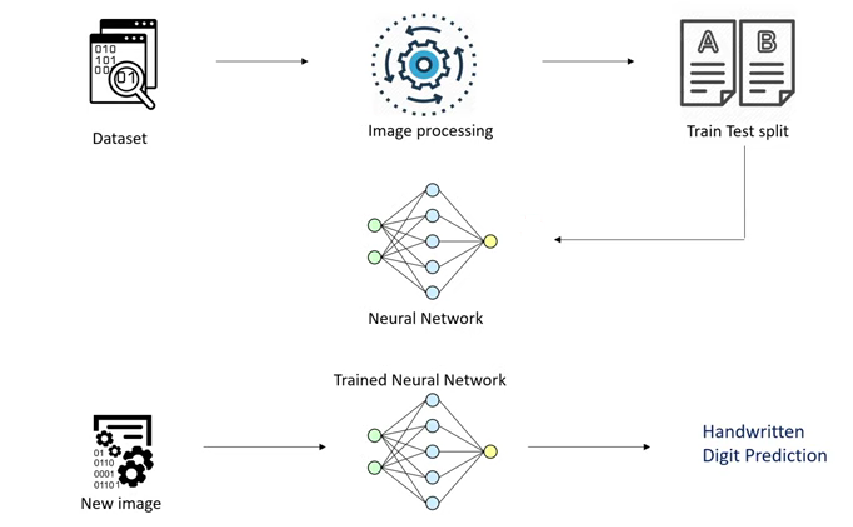
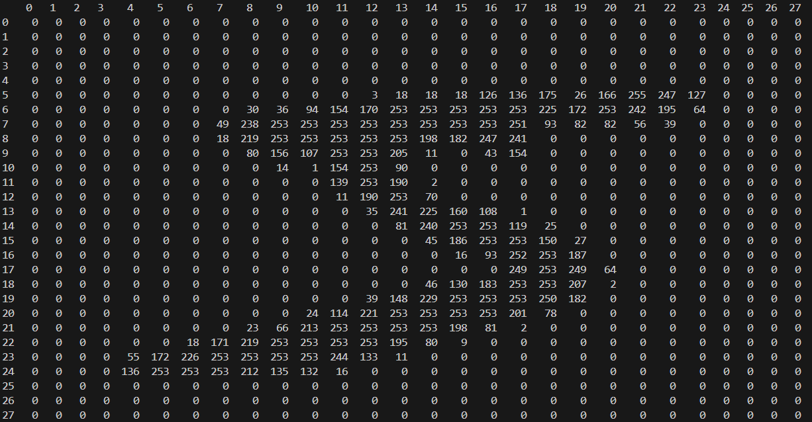
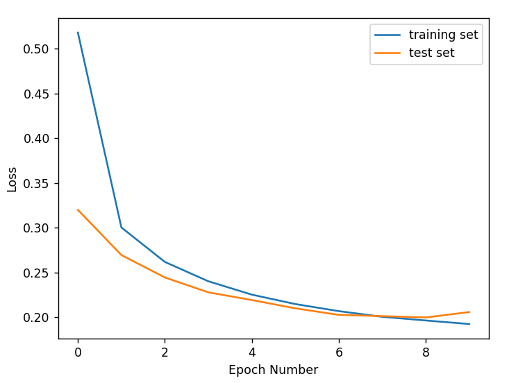
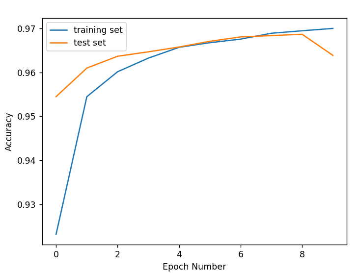
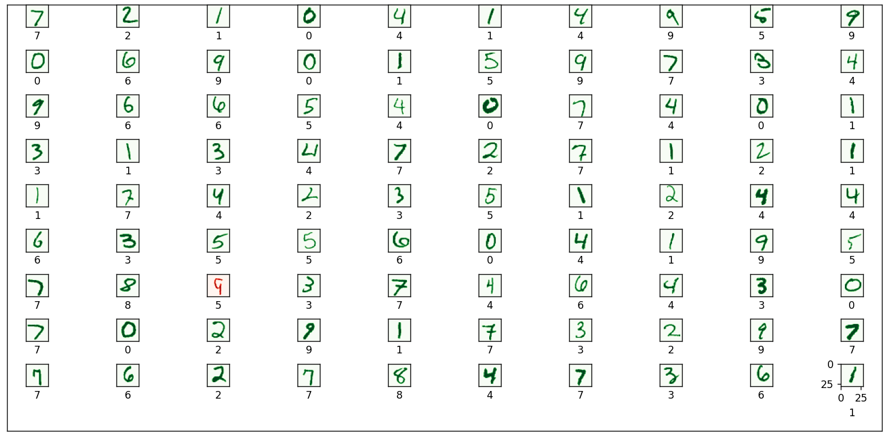

# MNIST Digit Classification with Neural Network 

## Workflow

## Data
 Each image in the dataset is a 28x28 matrix of integers (from 0 to 255). Each integer represents a color of a pixel.

## Loss/Accuracy

## Predictions on test data
Test examples and correspondent predictions to see how model performs.

